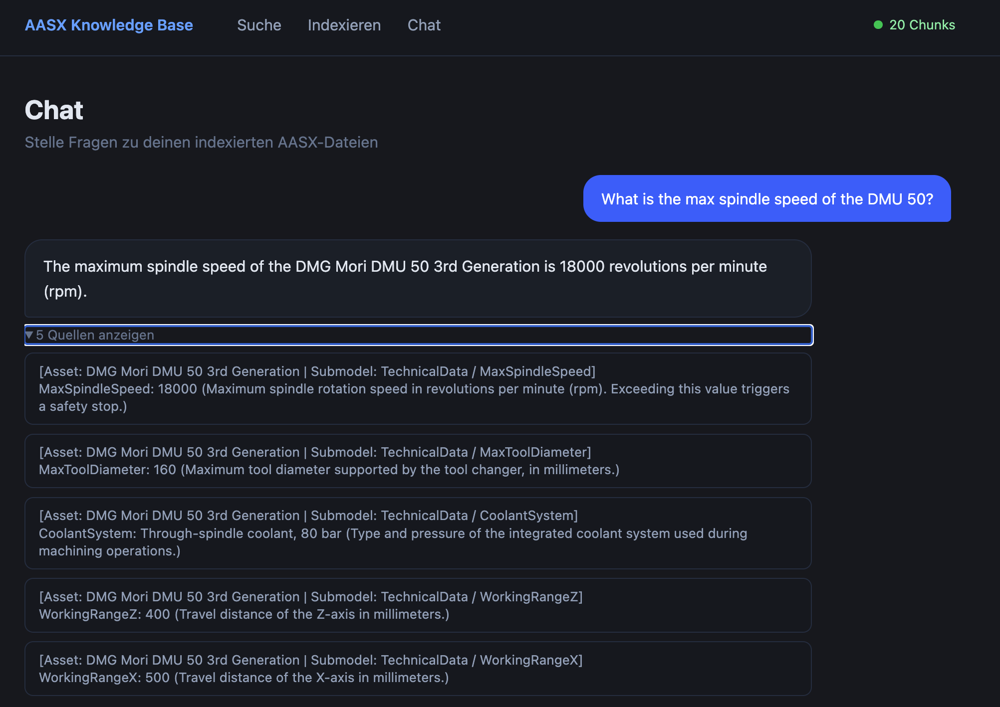

# AASX Knowledge Base 

> 🚧 **Active development.** Containerization  is in progress. And following Cloud deployment (AWS ECS + EFS), CI/CD, and test suite are planned. See [Roadmap](#roadmap) below.

Licensed under Apache-2.0 — see [LICENSE](LICENSE).

Semantic search over AASX files (Asset Administration Shell). Upload `.aasx` files, and they get automatically parsed into searchable chunks, embedded via OpenAI, and stored in a local vector database. You can then search in plain language through a web interface.

---

## What is this?

[AASX](https://industrialdigitaltwin.io/aas-specifications/IDTA-01001/v3.1.2/spec-metamodel/core.html#aas_attributes) iis a file format for digitally describing industrial assets 
   and components (e.g. machines, sensors, parts). This app makes 
   those files searchable via natural language.
   
   Instead of flipping through manuals, ask: "What is the serial 
   number of device XYZ?" or "What is the recommended temperature?" 
   The AI understands semantically and finds answers instantly 
   across all your machines.
   
   Enables intelligent knowledge management essential for Industry 4.0 
   and digital twin contexts.

<p align="center">
  
</p>

**How it works:**

```
.aasx file → Parse → Chunks → OpenAI Embeddings → Chroma (local)
                                                        ↓
                                        Nuxt 3 Frontend → FastAPI → Search / Chat result
```

Each chunk gets a breadcrumb so the LLM always knows which machine and submodel a value comes from. Two real chunks from [`examples/Cnc_1.aasx`](examples/Cnc_1.aasx):

```
[Asset: DMG Mori DMU 50 3rd Generation | Submodel: Nameplate / SerialNumber]
SerialNumber: SN-2024-CNC-0042 (Unique serial number assigned to this machine instance at the factory.)
```

```
[Asset: DMG Mori DMU 50 3rd Generation | Submodel: TechnicalData / MaxSpindleSpeed]
MaxSpindleSpeed: 18000 (Maximum spindle rotation speed in revolutions per minute (rpm). Exceeding this value triggers a safety stop.)
```

So a question like *"What is the max spindle speed of the DMU 50?"* can be matched to the right machine even when multiple assets are indexed.

---

## Requirements

- Python 3.11+
- Node.js 18+
- OpenAI API key

---

## Setup

### 1. Set up the Python environment

```bash
python -m venv .venv
source .venv/bin/activate        # Windows: .venv\Scripts\activate
pip install -r requirements.txt
```

### 2. Configure the API key

```bash
# Copy the template and fill in your key:
cp app/.env.example app/.env
# then edit app/.env and set OPENAI_API_KEY=sk-...
```

### 3. Install frontend dependencies

```bash
cd frontend
npm install
```

---

## Running the app

Both backend and frontend need to be running at the same time.

**Backend** (Terminal 1):
```bash
uvicorn app.main:app --reload
# available at http://localhost:8000
```

**Frontend** (Terminal 2):
```bash
cd frontend
npm run dev
# available at http://localhost:3000
```

Then open [http://localhost:3000](http://localhost:3000) in your browser.

---

## Indexing an AASX file

A sample file is included under [`examples/Cnc_1.aasx`](examples/Cnc_1.aasx) so you can try the pipeline without bringing your own data.

**Option A – Web interface:**
Open [http://localhost:3000/upload](http://localhost:3000/upload) and upload an `.aasx` file.

**Option B – Command line:**
```bash
python -m app.embed examples/Cnc_1.aasx
```

---

## API

| Method | Path | Description |
|--------|------|-------------|
| `GET` | `/health` | Status and number of indexed chunks |
| `POST` | `/query` | Semantic search — returns raw chunks with distances |
| `POST` | `/chat` | RAG chat — returns an LLM answer with sources |
| `POST` | `/index` | Upload and index an AASX file |

**Example query:**
```bash
curl -X POST http://localhost:8000/query \
  -H "Content-Type: application/json" \
  -d '{"query": "serial number", "n_results": 3}'
```

**Example chat:**
```bash
curl -X POST http://localhost:8000/chat \
  -H "Content-Type: application/json" \
  -d '{"message": "What is the serial number of the DMU 50 machine?", "n_results": 5}'
```

---

## Project structure

```
.
├── app/
│   ├── parse.py        # AASX → list of AASChunks (via BaSyx SDK); builds human-readable breadcrumbs
│   ├── embed.py        # Chunks → OpenAI Embeddings → Chroma 
│   └── main.py         # FastAPI: /health, /query, /chat, /index
├── frontend/
│   └── app/
│       ├── app.vue         # Layout + health badge + navigation
│       └── pages/
│           ├── index.vue   # Semantic search interface
│           ├── chat.vue    # RAG chat interface (gpt-4o-mini)
│           └── upload.vue  # File upload / indexing
├── chroma_data/        # local vector store (created automatically)
└── requirements.txt
```

---

## Stack

| Component | Technology |
|-----------|------------|
| Backend | FastAPI + Python 3.11 |
| Parsing | BaSyx Python SDK |
| Embeddings | OpenAI `text-embedding-3-small` |
| Vector store | Chroma (local, persistent) |
| Frontend | Nuxt 3 + Tailwind CSS |

---

## Roadmap

- [ ] Containerization (Dockerfile + docker-compose)
- [ ] Cloud deployment on AWS (ECS Fargate + EFS for Chroma + S3/CloudFront for the frontend)
- [ ] API-key protection on `/index` + `DEMO_MODE` for the live demo
- [ ] CORS config + frontend runtime config (`NUXT_PUBLIC_API_BASE`)
- [ ] CI (GitHub Actions: ruff + mypy + pytest)
- [ ] Test suite (`tests/` with FastAPI TestClient + OpenAI mocks)
- [ ] Architecture diagram (Mermaid) + screenshots in README
- [ ] Pinned dependencies + `pyproject.toml`
- [ ] CONTRIBUTING.md + CODE_OF_CONDUCT.md
- [ ] Scripted demo-AAS generator (BaSyx SDK) for fully self-authored sample data

---

## Commercial use & collaboration

This project is open source under Apache-2.0. You are free to use, fork, and adapt it.

If you're considering using it in a commercial context or would like to collaborate, I'd love to hear about it: [jakobvarenbud@gmail.com](mailto:jakobvarenbud@gmail.com)
